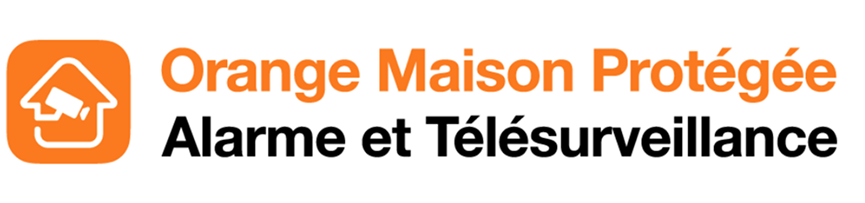
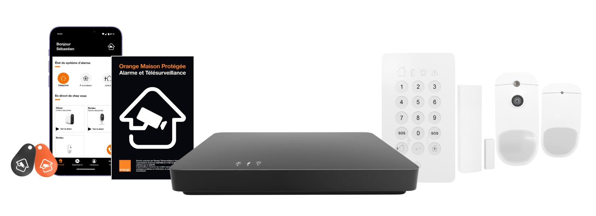

# Orange Maison Protégée for Home Assistant

  

Unofficial Home Assistant integration for **[Orange Maison Protégée](https://telesurveillance.orange.fr)**, Orange’s connected home-security offer in France.

  

Use the same account as the official mobile app. Arm and disarm the alarm, follow sensors around the house, and react to events in automations — without opening the Orange app.

Do not install this alongside the legacy [ha-maison-protegee](https://github.com/Identity-labs/ha-maison-protegee) integration: both use the same domain.

## What is Orange Maison Protégée?

  

Maison Protégée is Orange’s home alarm and 24/7 telesurveillance service. A hub in the house talks to door/window contacts, motion detectors, the keypad, and other wireless equipment. From the official app you can:

- Arm the system in **total** mode (everyone away) or **partial** mode (people still at home)
- Disarm the system
- See the status of each device (battery, connection, openings, temperatures)
- Read the event log (arm, disarm, detections, faults)

This integration brings that same system into Home Assistant so the alarm and its devices sit next to your lights, presence, and automations.

It is **not** an official Orange product. Cameras (live video) from the Orange app are not included.

## What you can do with this component

After login, Home Assistant creates one hub device for the contract and a device for each piece of equipment (named with its room when Orange provides one).

### Alarm

A standard **alarm control panel**:

| In Home Assistant | In the Orange app |
|-------------------|-------------------|
| Arm away | Total (full protection) |
| Arm home | Partial (night / at home) |
| Disarm | Disarm |

Use the usual services `alarm_control_panel.alarm_arm_away`, `alarm_arm_home`, and `alarm_disarm`, or the alarm card on a dashboard.

If the contract has no hub installed yet, the panel is not created; equipment and events can still appear.

### Equipment

For each compatible device, depending on what Orange reports:

- **Battery** level
- **Wi-Fi / radio signal**
- **Temperature** (°C), when the device has a sensor
- **Connection** (online / offline)
- **Status** (active / inactive)
- **Opening** on magnetic door/window contacts (MAG)

Devices show up in the device registry, so you can attach them to areas and mix them into dashboards.

### Events

- A **latest event** sensor with the most recent log line from the system
- A Home Assistant bus event `maison_protegee_event` for each new log entry (`event_id`, `event_type`, `date_time`, `user`, `source`, `message`)

Typical uses: notify when the alarm is armed, when a door opens, or when a detector fires.

### Diagnostics

Optional sensors for **contract ID** and **gateway ID**, useful for support and to confirm the right installation is linked.

### Options

In the integration options you can turn these groups on or off independently:

- Alarm panel
- Equipment sensors
- Events
- Diagnostics

You can also update the Orange credentials there.

## Installation

### HACS

This integration is available in HACS. Open the button below (HACS must already be installed), then download **Orange Maison Protégée** and restart Home Assistant.

  

Or in Home Assistant: **HACS → Integrations → Orange Maison Protégée → Download**.

### Manual

Copy `custom_components/maison_protegee` into your Home Assistant `custom_components` folder and restart.

## Setup

1. Restart Home Assistant after installing.
2. Go to **Settings → Devices & services → Add integration**.
3. Search for **Orange Maison Protégée**.
4. Enter the same customer ID / email and password as the mobile app.

  

If setup fails with *Invalid handler specified*, remove any leftover `maison_protegee` custom component, restart, and check **Settings → System → Logs**.

## Limitations

- Unofficial — Orange may change the service at any time
- Live cameras from the Orange app are not supported
- Use at your own risk and respect Orange’s terms of service
